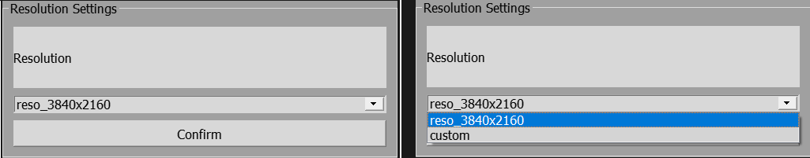
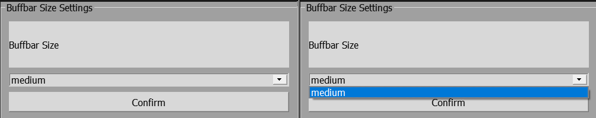
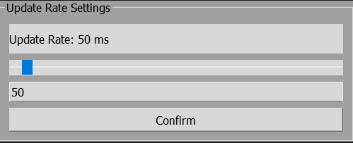
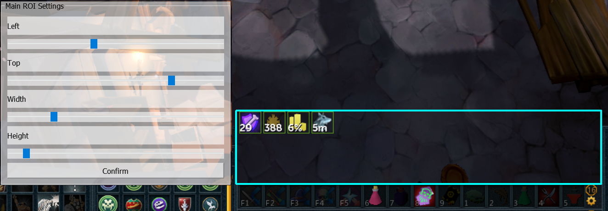
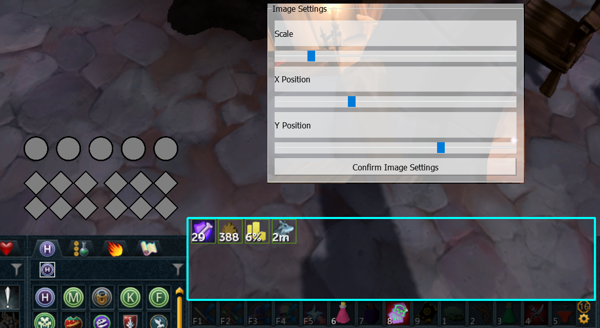
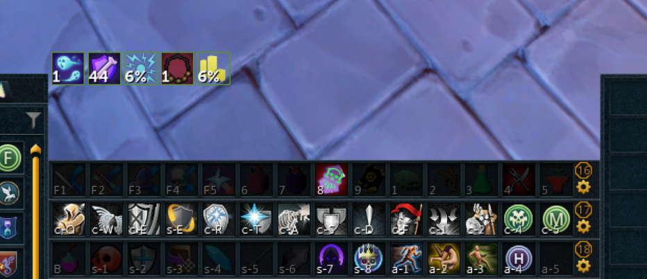

# What is RS3 Necro Gauge?

RS3 Necro Gauge is a UI plugin that allows RuneScape 3 players to track their Necromancy stackable buffs with improved visuals and sound alerts.

# Why? Don't we already have enough of these?

I will break down the reasoning behind creating a new Necro Gauge when there are already multiple available via the Alt-1 Toolkit.

1. **FPS Impact:** Alt-1 inherently causes a net FPS (frames per second) loss for most users, which becomes more pronounced at higher resolutions.
2. **Compatibility Limitations:** Alt-1 is only compatible with the following:
    - Interface Scaling - `100%`
    - Buff Bar - `small`

Due to these limitations, I created a new Necro Gauge to improve the quality of life for players. My plugin works with the following settings with minimal FPS impact :
- Any resolution
- Any Windows display scaling
- Any buff bar size
- Any interface scaling

# Will it run on my PC?

This depends on your operating system:
- **Windows PC:** Yes
- **MacOS/Linux:** No (Implementation for these systems is possible but I won't be doing it for now.)

# Do I need a GPU to run this?

No! All processing is done using the CPU of your computer.

# Features and Demo

This app supports the following customizations with presets provided by me:
1. Resolution
2. Windows Display Scaling
3. Buff Bar Size
4. Update Rate (How frequently the app updates its state, default is 50ms)

Interface scaling is not a preset parameter since it can vary greatly. To work with other than `100%` scaling, a custom preset will need to be made.

If you are not satisfied with the provided customizations or presets, you will need to manually set up a custom preset. Details on how to do this are below.

If you dislike the audio alerts, you can disable them using the Windows audio mixer or change the sound of the alert by following the first approach listed below.

Here is a short clip showing how the app looks and sounds.
https://github.com/zyoNoob/zyonsRS3NecroGauge/blob/main/media/NecroGauge.mp4

# How do I run it?

There are two ways to use this app:
1. Clone this repository or download the source code and run the Python script in a custom environment.
2. Download the executable provided in the releases for an easy, ready-to-use experience.

## If you decide to go with the first approach

Feel free to explore the code if you have privacy concerns. However, I will not provide instructions on setting up a custom conda environment. The libraries used are generic and available through PyPI, so running the script should not be too difficult.

## For the more laid-back and average user, welcome to your own necromancy paradise :P

### Preset Based Setup

1. Download the app, store it in a separate folder, and launch it.
2. The app will open on your primary monitor and prompt you to select a resolution preset. Choose one from the dropdown and click confirm.

  
  
<em>Resolution Selection</em>

3. Select the Windows display scaling, which can be found in your system's display settings, and click confirm.

  
  
<em>Display Scaling Selection</em>

4. Select a buff bar size from the dropdown presets, matching your RuneScape 3 settings, and click confirm.

  
  
<em>Buffbar Size Selection</em>

5. Select update rate of the application in using the slider, or type a numerical value. This is the delay between each cycle of stack tracking measured in miliseconds (ms), and click confirm.

  
  
<em>Update Rate Selection</em>

6. **Scanning Region of Interest (Very Important):**
    - Use the sliders (left, top, width, height) to ensure the cyan rectangle on the screen covers your RuneScape buff bar completely.
    - Once done, click confirm.

  
  
<em>Scanning Area Selection</em>

7. Adjust the scale and position of your necro gauge using the sliders. Once satisfied, click confirm to save the settings in a config.json file in the application folder, and the application will restart to function properly.

  
  
<em>Customise Scale and Position</em>

*To quit the application, `Alt+Tab` into it and press `Ctrl+Shift+Q` or use the Task Manager to close it.*

### Custom Setup

1. Download the app, store it in a separate folder, and launch it.
2. The app will open on your primary monitor and prompt you to select a resolution preset. Choose 'custom' in the dropdown and click confirm.

  
  
<em>Resolution Selection</em>

3. Select update rate of the application in using the slider, or type a numerical value. This is the delay between each cycle of stack tracking measured in miliseconds (ms), and click confirm.

  
  
<em>Update Rate Selection</em>

4. **Scanning Region of Interest (Very Important):**
    - Use the sliders (left, top, width, height) to ensure the cyan rectangle on the screen covers your RuneScape buff bar completely.
    - Once done, click confirm.

  
  
<em>Scanning Area Selection</em>

5. Adjust the scale and position of your necro gauge using the sliders. Once satisfied, click confirm to save the settings in a config.json file in the application folder, and the application will exit.

  
  
<em>Customise Scale and Position</em>

*You have now completed 50% of the work for custom settings. The app exited because we still need to provide it with buff images for your custom settings.*

5. To create your own buff images, start by getting different numbers of souls and capturing screenshots of the soul buff in the buff bar. Crop the images into square PNGs using MS Paint (Photoshop is too expensive for this task). A good tip for doing this, all buffs have a green border, use that as a reference to get clean cropped images.

  
  
<em>Screenshot of buff bar</em>

  
  
<em>Screenshot of square cropped buff `soul_1.png`, `soul_1_alt.png`</em>

6. Rename the images using this scheme:
    - Soul stack image -> `soul_{soulcount}.png, soul_{soulcount}_alt.png` (e.g., `soul_2.png`, `soul_2_alt.png` for 2 soul stacks).
    - Necrosis stack image -> `necrosis_{necrosiscount}.png` (e.g., `necrosis_4.png` for 4 necrosis stacks).
7. Copy or move these renamed images to the `custom_assets` folder created by the app.
8. Ensure all images for soul count values `[1,2,3,4,5]` and necrosis count values `[2,4,6,8,10,12]` exist.
9. Once all steps are complete, run the program again with your custom image settings. It should work flawlessly.
